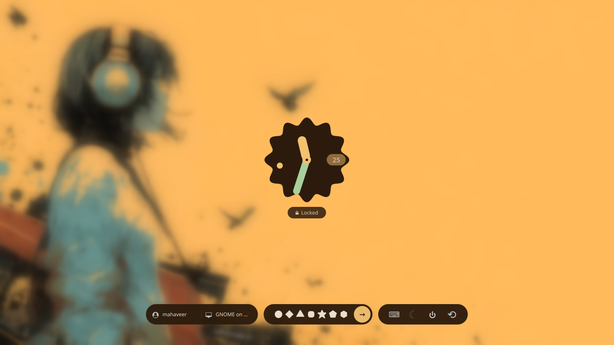
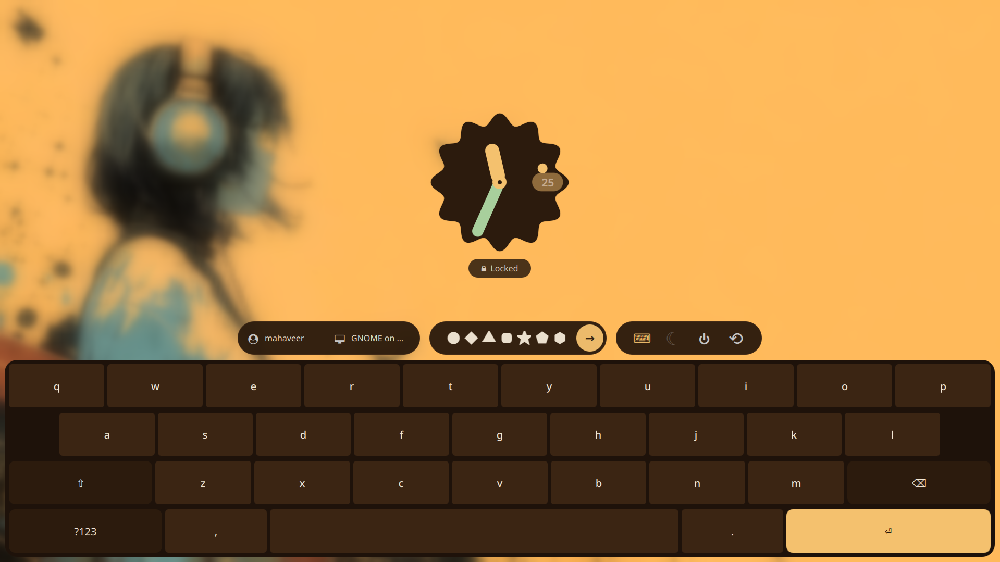

# Pixel UI SDDM Theme

Void UI SDDM is a sleek, minimalist login theme for **SDDM (Simple Desktop Display Manager)**, inspired by **Pixel OS UI**. It features a monochrome aesthetic, dot-matrix elements, and a clean, futuristic design tailored for Hyprland and KDE users.




## Features

- **Minimalist Design** – Inspired by Pixel OS UI.
- **Modular QML Components** – Structured for easy customization.
- **Dark and Light Modes** – Seamless adaptation to different setups.
- **Smooth Animations** – Lightweight yet visually appealing.
- **Custom Font Support** – Uses a dot-matrix-inspired typeface.

## Installation

1. Clone the repository:
   ```sh
   git clone -b pixel https://github.com/mahaveergurjar/sddm.git
   ```
2. Move the theme to SDDM's theme directory:
   ```sh
   sudo mv sddm /usr/share/sddm/themes/
   ```
3. Edit the sddm configuration to use the theme:
   ```sh
   sudo nano /etc/sddm.conf
   ```
   Add or modify the following:
   ```ini
   [Theme]
   Current=sddm
   ```
4. Restart sddm:
   ```sh
   sudo systemctl restart sddm
   ```

## Preview

If you want to test the theme without restarting SDDM, run:

```sh
sddm-greeter-qt6 --test-mode --theme /usr/share/sddm/themes/sddm
```

_Note: If you run into "module is not installed" errors, ensure you are using `sddm-greeter-qt6` and have `qt6-5compat` and `qt6-declarative` installed._

## Credits

- Inspired by **Pixel OS UI**.
- Built for **Hyprland and KDE users**.

---

**Contributions are welcome!** Feel free to fork and improve the theme.
